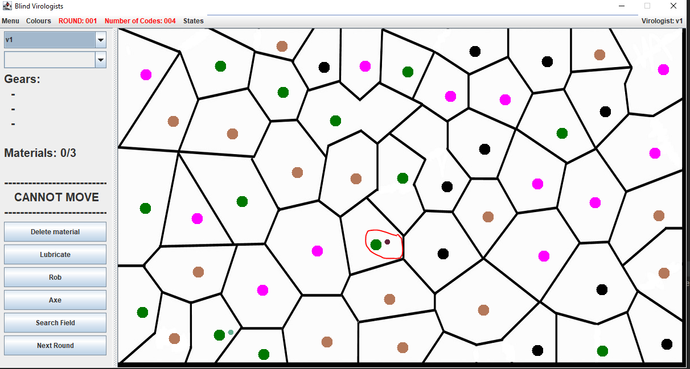
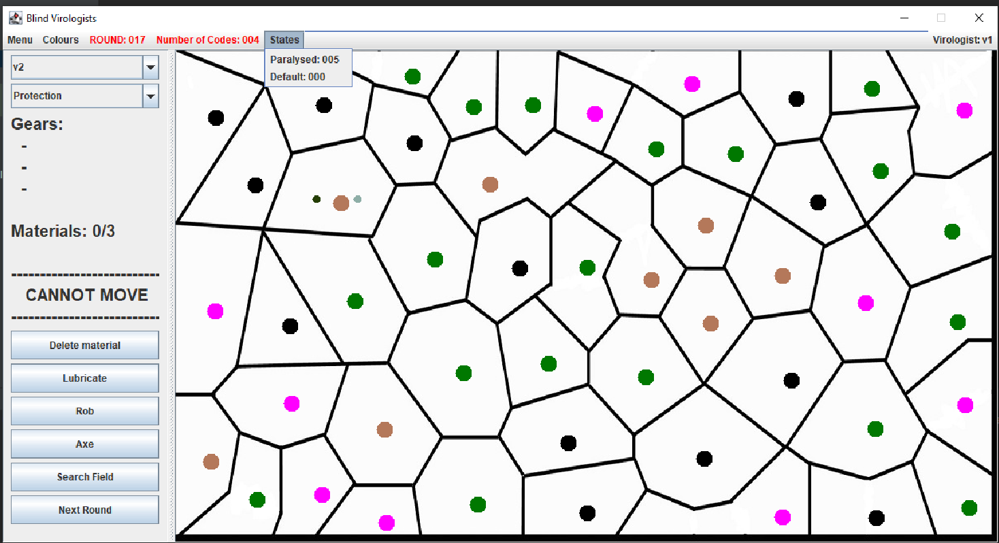
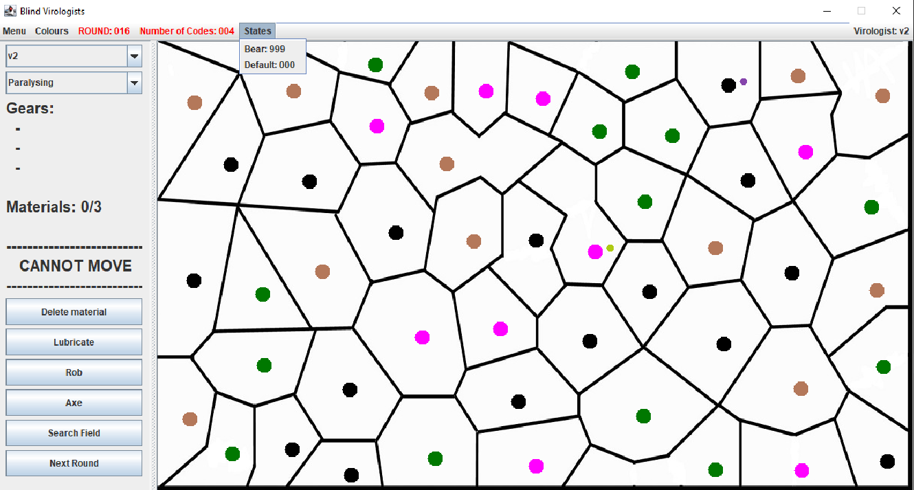
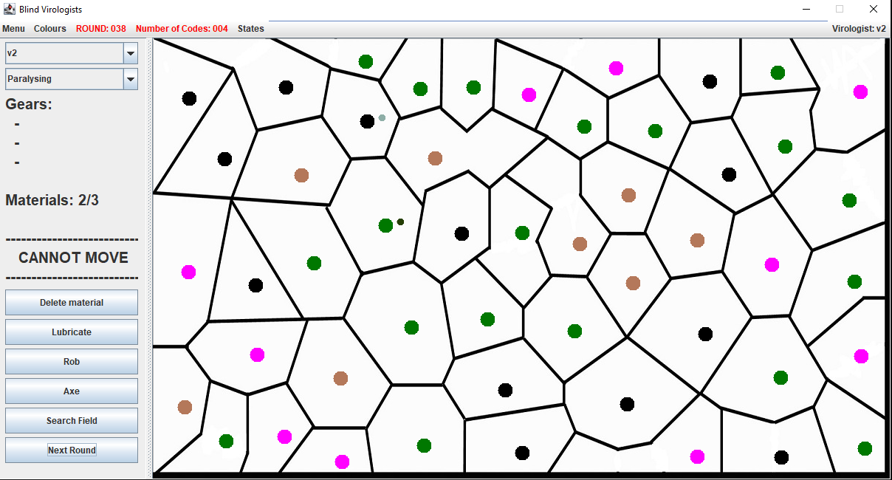
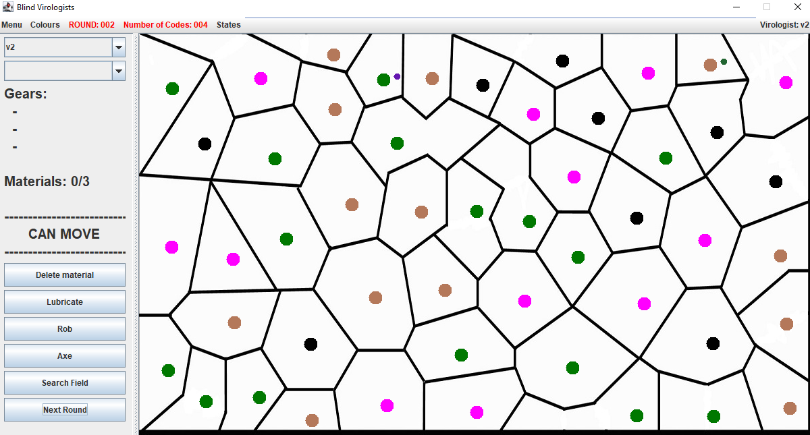
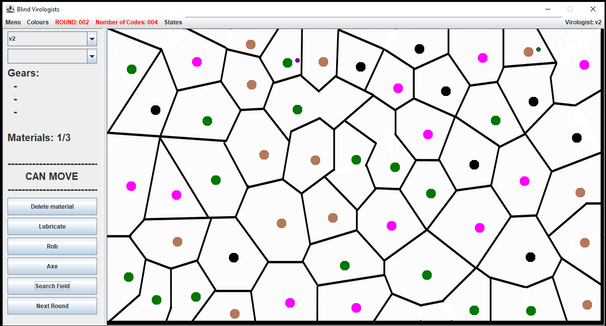

# Manuális tesztelés dokumentáció 

## A tesztelni kívánt funkciók 
1. Virológus léptetése -
2. Paralysing ágens használata -
3. Chorea ágens használata
4. Oblivion ágens használata
5. Protection ágens használata
6. Keresés laboratórium mezőn
7. Keresés fertőzött laboratórium mezőn
8. Keresés óvóhely mezőn
9. Keresés raktár mezőn
10. Rablás egy bénult virológustól
11. Balta használata egy másik virológuson
12. Találkozás a medvével
---
## 1: Virológus léptetése
### Teszteset célja
A teszteset célja annak vizsgálata, hogy a virológus a saját körében képes-e átlépni egy sajátjával szomszédos mezőre, és a lépése után már nem tud lépni máshova.
### Elvárt viselkedés
- a virológus csak a saját körében tud lépni
- a virológus a saját körében csak egyszer tud lépni
- a virológus csak a vele szomszédos mezőre tud lépni
### Dokumentáció 
- A virológussal kizárólag szomszédos mezőre lehet lépni hiába bróbálok máshova nem engedi, lépés után nagy "Cannot move" felirat jelzi hogy nem tud már lépni.

---
## 2: Paralysing ágens használata
### Teszteset célja
A teszteset célja annak vizsgálata, hogy a virológus a saját körében képes-e felkenni a Paralysing ágenst, ezzel bénító hatást eredményezve. 
### Elvárt viselkedés
- a virológus csak a saját körében tud ágenst kenni
- a virológus a Paralysing ágens felkenése után megkapja a Paralyzed állapotot
- a virológus a Paralysing ágens felkenése után nem tud mozogni
### Dokumentáció 
- A virológus ágenst csak akkor tud kenni ha ugyanazon mezőn tartozkodik egy másik virológus. Az ágens felkenése után a fertőzőtt virológus 5 körön keresztül nem tud mozogni.

---
## 3: Chorea ágens használata
### Teszteset célja
A teszteset célja annak vizsgálata, hogy a virológus a saját körében képes-e felkenni a Chorea ágenst, ezzel véletlenszerű lépést előidézve.
### Elvárt viselkedés
- a virológus csak a saját körében tud ágenst kenni
- a virológus a Chorea ágens felkenése után megkapja a Dancing állapotot
- a virológus a Chorea ágens felkenése után automatikusan véletlenszerű mezőkre lép
### Dokumentáció 
- Az ágens felkenése után, a fertőzütt virológussal nem lehet lépni, viszont minden körbe véletlenszerű mozgást végez.

---
## 4. Oblivion ágens használata
### Teszteset célja
A teszteset célja annak vizsgálata, hogy a virológus a saját körében képes-e felkenni az Oblivion ágenst, ezzel véletlenszerű lépést előidézve.
### Elvárt viselkedés
- a virológus csak a saját körében tud ágenst kenni
- a virológus a Oblivion ágens felkenése után elfelejti az összes megtanult kódot
### Dokumentáció 
- Az ágens használatához 1 anyag szükséges.
- A megfertőzött virológus ágensei eltünnek.
---
## 5. Protection ágens használata
### Teszteset célja
A teszteset célja annak vizsgálata, hogy a virológus a saját körében képes-e felkenni a Protection ágenst, ezzel véletlenszerű lépést előidézve.
### Elvárt viselkedés
- a virológus csak a saját körében tud ágenst kenni
- a virológus a Protection ágens felkenése után megkapja az Immune állapotot
- a virológus a Protection ágens felkenése után kivédi az összes vírust három körön keresztül
### Dokumentáció 
- A procettion ágenst céleszerű saját virológusra kenni
- Protection ágens hatása alatt más virológusok nem tudnak ágenst kenni ránk
- Az ágens használatához 2 anyag szükséges
---
## 6. Keresés laboratórium mezőn
### Teszteset célja
A teszteset célja annak vizsgálata, hogy a virológus a saját körében képes-e letapogatni egy laboratórium mezőt, és így az ott lévő kódot megtanulni.
### Elvárt viselkedés
- a virológus csak a saját körében tud laboratóriumot letapogatni
- a virológus a laboratórium letapogatása után megtanul egy kódot
### Dokumentáció 
- Labor mezőn a search field művelet segíségével lehet ágenst tapogatni.
- A megtanult kód bekerül a második szövegdobozba, ahonnan kiválasztva lehet használni.

---
## 7. Keresés fertőzött laboratórium mezőn
### Teszteset célja
A teszteset célja annak vizsgálata, hogy a virológus a saját körében képes-e letapogatni egy fertőzött laboratórium mezőt, és így medvévé válik-e.
### Elvárt viselkedés
- a virológus csak a saját körében tud fertőzött laboratóriumot letapogatni
- a virológus a laboratórium letapogatása után Bear státuszt kap
- a virológus a laboratórium letapogatása után nem tud lépni, véletlenszerűen mozog
### Dokumentáció 
- Onnan lehet tudni hogy egy labor fertőző, hogy a Search field művelet után medvévé változik a virológus. Ezután nem tudjuk irányítani, minden körben véletlenszerűen lép egyet.

---
## 8. Keresés óvóhely mezőn
### Teszteset célja
A teszteset célja annak vizsgálata, hogy a virológus a saját körében képes-e letapogatni egy óvóhelyet, és az ott lévő tárgyat megszerezni.
### Elvárt viselkedés
- a virológus csak a saját körében tud óvóhelyet letapogatni
- a virológus felszerelésében megjelenik a tárgy
### Dokumentáció 
- Shelter mező a search field művelette eszközöket tudunk felvenni amik a felvétel után a gears menüben láthatóak.
- Ha már van 3 eszközünk akkor nem tudunk felvenni többet

---
## 9. Keresés raktár mezőn
### Teszteset célja
A teszteset célja annak vizsgálata, hogy a virológus a saját körében képes-e letapogatni egy raktárat, és az ott lévő tárgyat megszerezni.
### Elvárt viselkedés
- a virológus csak a saját körében tud raktárat letapogatni
- a virológus felszerelésében megjelenik egy anyag
### Dokumentáció 
- Ha a virológusunk egy storage mezőn tartózkodik, a search field művelettel anyagokat tudunk felvenni amennyiben valaki más nem fosztotta ki előttünk a raktárat.
- Egy raktárból több anyagot is fel lehet venni (ha van)
- Maximum 3 anyagunk lehet
- Ha nincs anyag, akkor nem tudunk felvenni

---
## 10. Rablás egy bénult virológustól
### Teszteset célja
A teszteset célja annak vizsgálata, hogy a virológus a saját körében képes-e kirabolni egy bénult virológust, és a nála lévő tárgyat megszerezni.
### Elvárt viselkedés
- a virológus csak a saját körében tud másik virológust kirabolni
- a virológus csak bénult virológust tud kirabolni
- a virológus felszerelésében a rablás után megjelenik a bénult virológus anyaga 
### Dokumentáció 

---
## 11. Balta használata egy másik virológuson
### Teszteset célja
A teszteset célja annak vizsgálata, hogy a virológus a saját körében képes-e megölni egy másik virológust a nála lévő baltával.
### Elvárt viselkedés
- a virológus csak a saját körében tud másik virológust megölni
- a virológus csak vele egy mezőn lévő másik virológust tud megölni
- a halott virológus eltűnik a pályáról
- a balta elhasználódásakor eltűnik a virológus felszereléséből
### Dokumentáció 

---
## 12: Találkozás a medvével
### Teszteset célja
A teszteset célja annak vizsgálata, hogy a virológus, amennyiben egy medvével rendelkező mezőre lép, megfertőződik-e maga is a medvevírussal.
### Elvárt viselkedés
- a virológus a medvével rendelkező mezőre lépés után megfertőződik a medvevírussal
- a virológus a lépés után Bear státuszt kap
- a virológus a lépés után nem tud többet lépni, véletlenszerűen mozog
### Dokumentáció 

---