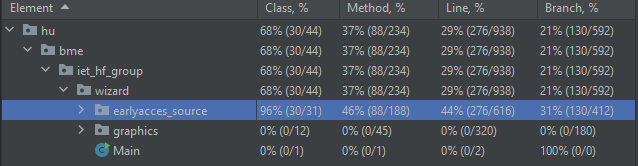

### Egységtesztek írása és kódlefedettség ellenőrzése

Az egységtesztek megírását a jUnit4 tesztelési keretrendszer használatával végeztük el ketten, Jáky Mátyás és Hudák János. Legelőször a keretrendszer függőségeit importáltuk a projektbe, majd elkészültek az első, kezdetleges egységtesztek. Az ezek során szerzett tapasztalatokból képesek voltunk teljesen újragondolni a kezdeti koncepcióinkat, és új struktúrában, letisztult metodika mentén folytattuk tovább a munkát. 

A tesztek elkészültével az egyes függvények tesztjeit külön funkciócsoportjaik szerint egységes, áttekinthető mappaszerkezetbe soroltuk. A hibásan működő teszteket javítottuk, a helyes működés kikövetkeztetéséhez a dokumentációt használtuk. A tesztek írása közben folyamatosan ellenőriztük a kódlefedettséget, ennek alapján döntöttünk arról, mit érdemes még tesztelni, így az csaknem összes model osztályt teszteltük. Kíváncsiságból összehasonlítottuk a JaCoCo és az IntelliJ beépített kódlefedettségmérőjét is, számottevő különbséget azonban nem fedeztünk fel. 
 

